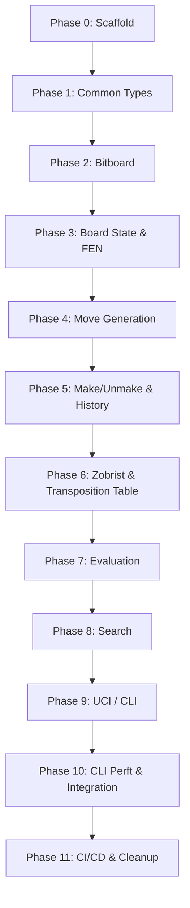

# Rudim: C# → Rust Migration Plan

> **Strategy**: Strangler Fig pattern — bottom-up, module by module. Each phase produces a compiling, fully-tested Rust crate before the next phase begins. The C# codebase remains the reference implementation for correctness validation throughout.

---

## Architecture Overview

### C# Module → Rust Module Mapping

| C# File(s) | Rust Module | Phase |
|---|---|---|
| `Common/Square.cs`, `Piece.cs`, `Side.cs`, `Castle.cs`, `Constants.cs`, `Helpers.cs`, `GamePhase.cs`, `Random.cs`, `ExceededMaximumRetryException.cs` | `src/common/` | 1 |
| `Common/Move.cs`, `MoveTypes.cs` | `src/common/moves.rs` | 1 |
| `Bitboard/Bitboard.cs`, `.Attacks.cs`, `.Lookups.cs`, `.Magics.cs` | `src/bitboard/` | 2 |
| `Board/BoardState.cs`, `.FEN.cs`, `.Static.cs` | `src/board/state.rs`, `fen.rs` | 3 |
| `Board/BoardState.Moves.cs` | `src/board/movegen.rs` | 4 |
| `Board/BoardState.cs` (MakeMove/UnmakeMove), `History.cs` | `src/board/make_move.rs`, `history.rs` | 5 |
| `Common/Zobrist.cs`, `TranspositionTable.cs` | `src/common/zobrist.rs`, `tt.rs` | 6 |
| `Board/MoveOrdering.cs`, `PieceSquareTableEvaluation.cs`, `PawnStructureEvaluation.cs` | `src/eval/` | 7 |
| `Search/Negamax.cs`, `.Helpers.cs`, `Quiescence.cs`, `IterativeDeepening.cs` | `src/search/` | 8 |
| `CLI/`, `CLI/UCI/` | `src/uci/` | 9 |
| `Perft/`, `Program.cs`, `Global.cs` | `src/perft/` (CLI), `src/main.rs`, `src/engine.rs` | 10 |

---

## Phase 0: Project Scaffold
- [x] Run `cargo init` inside `d:\Code\rudim` (creates `src/main.rs`, `Cargo.toml`)
- [x] Configure `Cargo.toml`: name = `rudim`, edition = `2024`
- [x] Add dev-dependency: `criterion` (benchmarks)
- [x] Create module skeleton: `src/lib.rs`, `src/common/mod.rs`, `src/bitboard/mod.rs`, `src/board/mod.rs`, `src/eval/mod.rs`, `src/search/mod.rs`, `src/uci/mod.rs`, `src/perft/mod.rs`, `src/engine.rs`
- [x] Verify `cargo build` and `cargo test` pass (empty)
- [x] **Gate**: `cargo build` succeeds, `cargo test` reports 0 tests passed

---

## Phase 1: Common Types & Primitives

Migrate all leaf-level types that have zero internal dependencies.

### 1.1 Enums & Constants
- [x] `src/common/square.rs` — `Square` enum (a8=0..h1=63, NoSquare=64), with `From<usize>` / `Into<usize>` impls
- [x] `src/common/piece.rs` — `Piece` enum (Pawn..King, None)
- [x] `src/common/side.rs` — `Side` enum (White, Black, Both) + `Side::other()` method
- [x] `src/common/castle.rs` — `Castle` as a bitflags type (`WhiteShort=1, WhiteLong=2, BlackShort=4, BlackLong=8`)
- [x] `src/common/constants.rs` — all constants (SIDES=2, SQUARES=64, PIECES=6, MAX_PLY=64, etc.)
- [x] `src/common/helpers.rs` — FEN string constants (STARTING_FEN, KIWI_PETE_FEN, ENDGAME_FEN, ADVANCED_MOVE_FEN)

### 1.2 Random Number Generator
- [x] `src/common/random.rs` — Xorshift PRNG with identical seed `1804289383`, `next_u64()`, `next_i32()`, `reset_seed()`
- [x] **Tests**: Port `RandomTest.cs` — verify 500 unique u64s and 500 unique i32s from deterministic seed

### 1.3 Move & MoveType
- [x] `src/common/move_type.rs` — `MoveType` struct/enum encoding (Value, Piece, PromotionChar, IsCapture) matching C# values exactly
- [x] `src/common/moves.rs` — `Move` struct (source: Square, target: Square, move_type: MoveType, score: i32), `Move::NO_MOVE`, `Eq`/`Hash` impls, `parse_long_algebraic()`, `is_capture()`, `is_promotion()`, `is_castle()`, `promotion_char()`
- [x] **Tests**: Port `MoveEqualityTest.cs` — equal moves, different source/target/type, null comparison, NoMove identity

### 1.4 GamePhase
- [x] `src/common/game_phase.rs` — `PIECE_CONSTANTS`, `TOTAL_PHASE`, `PHASE_FACTOR`, `ONLY_PAWNS`, `add_phase()`, `remove_phase()`, `get_clipped_phase()`
- [x] **Tests**: Port `GamePhaseTest.cs` — max phase at start, zero with only kings, clipped above max

### 1.5 Wire Up
- [x] `src/common/mod.rs` — re-export all submodules
- [x] **Gate**: `cargo test` — all Phase 1 tests pass, module compiles independently

---

## Phase 2: Bitboard

### 2.1 Core Bitboard
- [x] `src/bitboard/mod.rs` — `Bitboard` struct wrapping `u64`, with `get_bit()`, `set_bit()`, `clear_bit()`, `get_lsb()` (trailing zeros), `Eq`/`Hash`
- [x] **Tests**: Port `BitboardTest.cs` — set/clear/get bits, idempotency, LSB

### 2.2 Attack Generation
- [x] `src/bitboard/attacks.rs` — `get_pawn_attacks()`, `get_knight_attacks()`, `get_king_attacks()`, `get_bishop_attacks()`, `get_rook_attacks()`, `get_queen_attacks()`
- [x] File masks: `FILE_A`, `FILE_B`, `FILE_G`, `FILE_H`, `FILE_AB`, `FILE_GH` as constants
- [x] **Tests**: Port all 14 tests from `BitboardAttacksTest.cs` — central/corner pawn, knight, king, bishop ±blockers, rook ±blockers, queen

### 2.3 Magic Bitboards
- [x] `src/bitboard/magics.rs` — `get_bishop_mask()`, `get_rook_mask()`, `get_occupancy_mapping()`, `find_magic_number()` (dev-only)
- [x] Hard-coded `BISHOP_MAGICS` and `ROOK_MAGICS` arrays (copy exact values from C#)
- [x] **Tests**: Port `BitboardMagicsTest.cs` — central/corner bishop/rook masks, occupancy mappings

### 2.4 Lookup Tables
- [x] `src/bitboard/lookups.rs` — Static lookup tables initialized via `std::sync::LazyLock`: `PAWN_ATTACKS[2][64]`, `KNIGHT_ATTACKS[64]`, `KING_ATTACKS[64]`, `BISHOP_ATTACKS[64][512]`, `ROOK_ATTACKS[64][4096]`
- [x] `get_bishop_attacks_from_table()`, `get_rook_attacks_from_table()`, `get_queen_attacks_from_table()`
- [x] **Validation**: Compare all 64 squares × piece type lookup values against C# output

### 2.5 Wire Up
- [x] **Gate**: `cargo test` — all Phase 2 tests pass. Bitboard module is self-contained.

---

## Phase 3: Board State & FEN Parsing

### 3.1 BoardState Core
- [x] `src/board/state.rs` — `BoardState` struct: `pieces: [[Bitboard; 6]; 2]`, `occupancies: [Bitboard; 3]`, `piece_mapping: [Piece; 64]`, `side_to_move`, `en_passant_square`, `castle`, `moves: Vec<Move>`, `move_count`, `best_move`, `phase`, `board_hash`, `last_draw_killer` (Note: `ClippedPhase` property is moved to `get_clipped_phase()` in `game_phase.rs`)
- [x] `add_piece()`, `remove_piece()`, `get_piece_on()` (both variants), `is_in_check()`, `Default::default()` → starting position
- [x] Castling constants array (64-entry table)

### 3.2 FEN Parser
- [x] `src/board/fen.rs` — `BoardState::parse_fen()`: parse pieces, side to move, castling, en passant
- [x] `symbol_to_piece()`, `symbol_to_side()`
- [x] **Tests**: Port `BoardStateFENTest.cs` — verify all 12 piece bitboards, 3 occupancies, side, castle, en passant for starting position
- [x] Additional FEN tests: KiwiPete, Endgame, AdvancedMove positions

### 3.3 Equality & Display
- [x] `PartialEq`/`Eq` for `BoardState` (compare pieces, occupancies, side, en passant, castle, moves)
- [x] `Display` trait

### 3.4 Wire Up
- [x] **Gate**: `cargo test` — FEN parsing produces identical bitboard values to C#

---

## Phase 4: Move Generation

- [x] `src/board/movegen.rs` — `BoardState::generate_moves()`
- [x] `generate_pawn_moves()` — pushes (single + double), attacks, en passant, promotions (4 types × capture/quiet)
- [x] `generate_knight_moves()`, `generate_bishop_moves()`, `generate_rook_moves()`, `generate_queen_moves()` — from lookup tables
- [x] `generate_king_moves()` + `generate_castle_moves()` — all castling conditions
- [x] `is_square_attacked()` — check all piece types
- [x] Helper: `add_pawn_move()`, `add_move_to_moves_list()`, `is_square_capture()`
- [x] **Tests**: Port `BoardStateMovesTest.cs` — starting=20, KiwiPete=48, AdvancedMove=42
- [x] **Cross-validation**: For each of the 4 standard FEN positions, assert that the set of generated moves matches C# output exactly (sorted by source+target+type)

### Gate
- [x] `cargo test` — move generation counts match C# for all standard positions

---

## Phase 5: Make/Unmake Move & History

### 5.1 History Stack
- [x] `src/board/history.rs` — `History` struct with fixed-size array of `BoardHistory` entries (4096), push/pop index, `has_hash_appeared_twice()`, `clear()`, `is_empty()`
- [x] `BoardHistory` struct: captured_piece, en_passant, castle, board_hash, last_draw_killer, best_move

### 5.2 Make/Unmake
- [x] `src/board/make_move.rs` — `BoardState::make_move()`: remove piece from source, handle captures, promotions, castling (rook movement), update castling rights, en passant, flip side, save history, increment Zobrist hash
- [x] `BoardState::unmake_move()`: restore from history stack
- [x] `make_null_move()` / `undo_null_move()`
- [x] `is_draw()` — 50-move rule + threefold repetition via history

### 5.3 Tests
- [x] Port `HistoryTest.cs` — make then unmake restores identical state
- [x] Port `BoardStateMovesTest.ShouldMakeAndUndoNullMoveCorrectly`
- [x] Port `DrawTest.cs` — 50-move rule detection, threefold repetition (4 tests), reset after pawn move, reset after capture
- [x] Port `ZobristTest.cs` — hash restoration for quiet, capture, en passant, promotion, castling (11 inline data cases)
- [x] **Bit-exact validation**: After make+unmake of every legal move from starting position, board hash must match original

### Gate
- [x] `cargo test` — all make/unmake and draw detection tests pass

---

## Phase 6: Zobrist Hashing & Transposition Table

### 6.1 Zobrist
- [x] `src/common/zobrist.rs` — Zobrist table `[14][64]` initialized from deterministic PRNG (same seed as C#), `get_board_hash()`, `hash_castling_rights()`, `flip_side_to_move_hashes()`, `hash_en_passant()`
- [x] **Critical**: PRNG seed and call order must exactly match C# to produce identical hash values

### 6.2 Transposition Table
- [x] `src/common/tt.rs` — `TranspositionTable` with capacity 65536, `clear()`, `get_hash_move()`, `get_entry()`, `submit_entry()`, `collect_principal_variation()`, `adjust_score()`, `retrieve_score()`
- [x] `TranspositionTableEntry` struct, `TranspositionEntryType` enum (Exact, Alpha, Beta)

### 6.3 Tests
- [x] Verify Zobrist hash for starting position matches C# value exactly
- [x] Verify TT store/retrieve round-trip
- [x] Score adjustment near checkmate boundaries

### Gate
- [x] `cargo test` — Zobrist produces bit-identical hashes to C#, TT operations correct

---

## Phase 7: Evaluation

### 7.1 Move Ordering
- [ ] `src/eval/move_ordering.rs` — MVV-LVA table (7×7), killer moves `[2][MAX_PLY]`, history moves `[12][64]`, `populate_move_score()`, `add_killer_move()`, `add_history_move()`, `reset()`, `sort_next_best_move()`, `populate_hash_move()`
- [ ] **Tests**: Port `MoveOrderingTest.cs` — sort by score, idempotent sort

### 7.2 Piece-Square Table Evaluation
- [ ] `src/eval/pst.rs` — Midgame + Endgame PST tables (copy exact values from Rofchade), `evaluate()` with tapered eval using game phase, `mirror_square()`
- [ ] **Tests**: Port `PieceSquareTableEvaluationTest.cs` — starting=0 (both sides), endgame=-3, kiwipete=56, advanced=605

### 7.3 Pawn Structure Evaluation
- [ ] `src/eval/pawns.rs` — File masks, adjacent file masks, passed pawn masks. `evaluate()`: doubled pawn penalty, isolated pawn penalty, passed pawn bonus
- [ ] **Tests**: Port all 8 `PawnStructureEvaluationTest.cs` tests — no pawns, symmetric, doubled white/black, isolated, passed white/black, adjacent file blocking

### Gate
- [ ] `cargo test` — all evaluation scores match C# exactly for standard positions

---

## Phase 8: Search

### 8.1 Quiescence Search
- [ ] `src/search/quiescence.rs` — `search()` with alpha-beta on captures only, standing pat evaluation, node counter

### 8.2 Negamax
- [ ] `src/search/negamax.rs` — `search()` with alpha-beta + PVS, null move pruning, TT probe/store, draw detection
- [ ] PVS: `search_deeper()`, `principal_variation_search()`
- [ ] Helpers: `alpha_update()`, `beta_cutoff()`, `populate_move_scores()`, `can_prune_null_move()`

### 8.3 Iterative Deepening
- [ ] `src/search/iterative_deepening.rs` — depth 1..N loop, cancellation token (use `AtomicBool` or `mpsc` channel), PV collection, info string output
- [ ] `BoardState::find_best_move()`

### 8.4 Tests
- [ ] Port `TraversalTest.cs` — **deterministic node counts and scores** for 4 positions at depth 8-9 (these values validate the entire engine pipeline)
- [ ] Port `TacticsTest.cs` — puzzle position `r4r2/pb4kp/...` → best move `f4f8`

### Gate
- [ ] `cargo test` — traversal node counts and scores match C# exactly (this is the ultimate correctness gate)

---

## Phase 9: UCI Protocol & CLI

### 9.1 CLI Framework
- [ ] `src/uci/cli.rs` — main input loop, command dispatch (`info`, `uci`, `exit`)

### 9.2 UCI Commands
- [ ] `src/uci/mod.rs` — `UciClient` holding board state, debug mode
- [ ] `position` — startpos / fen + moves parsing
- [ ] `go` — depth, wtime/btime/winc/binc, movetime, infinite; async search with cancellation
- [ ] `isready` / `ucinewgame` / `stop` / `debug` / `quit`
- [ ] `src/uci/time_management.rs` — `calculate_move_time(clock, increment)`

### 9.3 Tests
- [ ] Port `InfoCommandTest.cs`, `DebugCommandTest.cs`, `IsReadyCommandTest.cs`, `UciNewGameCommandTest.cs`, `PositionCommandTest.cs`, `TimeManagementTest.cs`
- [ ] Time management: simulate 75-400 move games without exhausting clock (11 inline data cases)

### Gate
- [ ] `cargo test` — all UCI tests pass
- [ ] Manual smoke test: run binary, type `uci`, `isready`, `position startpos`, `go depth 6`, verify output

---

## Phase 10: CLI Perft & End-to-End Integration

### 10.1 Perft Driver (CLI)
- [ ] `src/perft/mod.rs` — Reimplement as a CLI tool: `traverse()` recursive node counter, `--perft` should run `perft_test()` logic
- [ ] Perft data: Starting (depths 0-6), KiwiPete (1-5), Endgame (1-7)

### 10.2 Engine State
- [ ] `src/engine.rs` — `Global` equivalent: `reset()`, `set_ready()`, `is_ready()`

### 10.3 Main Entry Point
- [ ] `src/main.rs` — CLI arg parsing: `--benchmark`, `--perft`, default → UCI loop

### 10.4 Integration Tests
- [ ] `tests/perft.rs` — perft counts for all standard positions and depths
- [ ] `tests/uci_integration.rs` — end-to-end UCI command sequences via stdin/stdout pipes

### Gate
- [ ] `cargo test` — all perft counts match known values
- [ ] Perft speed benchmark: Rust should be ≥ equivalent to C# at depth 6

---

## Phase 11: CI/CD, Benchmarks & Cleanup

- [ ] GitHub Actions workflow: `cargo build`, `cargo test`, `cargo clippy`, `cargo fmt --check`, rewrite dependabot to scan for rust
- [ ] Criterion benchmarks: `find_best_move` at depth 6-7 for all 4 standard positions
- [ ] Remove C# project files (`.sln`, `.csproj`, `Rudim/`, `Rudim.Test/`) or move to `legacy/` branch
- [ ] Update `README.md` — Rust build instructions, architecture overview
- [ ] Cross-compilation targets: Windows, Linux, macOS
- [ ] Publish workflow for tagged releases
- [ ] **Final Gate**: Full CI green, perft correct, tournament test (200 games 5+0 vs latest C# build, ELO should be ≈ equivalent)

---

## Key Design Decisions for Rust

| Concern | Decision |
|---|---|
| **Bitboard** | Newtype struct wrapping `u64`, `Copy + Clone + Eq + Hash` |
| **Static init** | `std::sync::LazyLock` (stable since 1.80) for lookup tables |
| **Move list** | `Vec<Move>` (stack-allocated `ArrayVec<Move, 256>` is a future optimization) |
| **History** | Fixed array `[BoardHistory; 4096]` with index, no heap allocation |
| **TT** | `Vec<Option<TTEntry>>` with power-of-2 capacity, index via `hash & (cap-1)` |
| **Cancellation** | `Arc<AtomicBool>` shared between search thread and UCI thread |
| **Error handling** | `thiserror` crate for custom errors, no panics in engine core |
| **Testing** | Built-in `#[cfg(test)]` modules + `tests/` directory for integration tests |
| **Unsafe** | Avoid entirely — no unsafe needed for this engine |

---

## Cross-Validation Strategy

After each phase, run this checklist:

1. **Compile**: `cargo build` — zero warnings
2. **Lint**: `cargo clippy` — zero warnings
3. **Format**: `cargo fmt --check` — passes
4. **Unit Tests**: `cargo test` — all pass
5. **Bit-exact**: Where applicable, compare numeric outputs (hashes, eval scores, node counts, perft counts) against C# reference values
6. **Regression**: All previous phase tests still pass

> [!IMPORTANT]
> The single most important validation is **Phase 8's `TraversalTest`**. If the Rust engine produces identical node counts and scores at depth 8 for all 4 standard positions, the entire pipeline (bitboard → movegen → make/unmake → zobrist → TT → eval → search) is correct.

---

## Test Count Summary

| Phase | Tests Ported From | Approx Count |
|---|---|---|
| 1 | `RandomTest`, `MoveEqualityTest`, `GamePhaseTest` | ~12 |
| 2 | `BitboardTest`, `BitboardAttacksTest`, `BitboardMagicsTest` | ~22 |
| 3 | `BoardStateFENTest` | ~4 |
| 4 | `BoardStateMovesTest` (generate) | ~3 |
| 5 | `HistoryTest`, `DrawTest`, `ZobristTest`, null move | ~18 |
| 6 | Zobrist hash identity, TT round-trip | ~5 |
| 7 | `MoveOrderingTest`, `PieceSquareTableEvaluationTest`, `PawnStructureEvaluationTest` | ~15 |
| 8 | `TraversalTest`, `TacticsTest` | ~5 |
| 9 | `InfoCommandTest`, `DebugCommandTest`, `IsReadyCommandTest`, `UciNewGameCommandTest`, `PositionCommandTest`, `TimeManagementTest` | ~20 |
| 10 | Perft integration | ~18 |
| **Total** | | **~122** |
